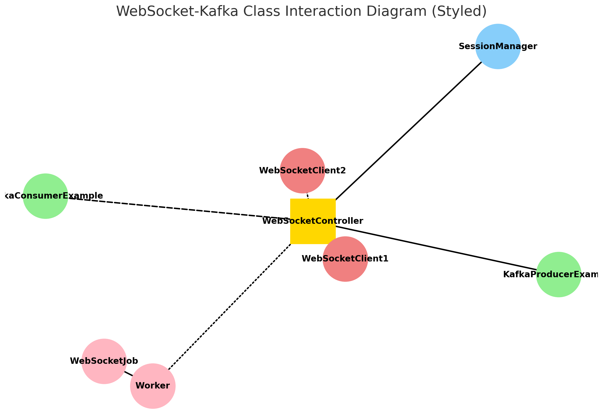

# Websocket + Kafka Chat Application

This project integrates WebSockets for real-time chat functionality and Kafka for message processing and other backend operations. It's designed to be platform-agnostic, allowing WebSocket clients from any platform to connect seamlessly.


## Architecture diagram



- **WebSocket-Kafka Architecture Diagram**: 


- **WebSocket-Kafka Class Interaction Diagram (Styled)**:




---

## Features

- **Real-time Chat**: Using WebSockets, users can send and receive messages in real-time.
  
- **Kafka Integration**: All chat messages are processed through Kafka, allowing for scalable and reliable message processing.
  
- **Custom Kafka Operations**: Apart from handling chat messages, Kafka is also used for [define your custom operation, e.g., "analyzing chat sentiment", "archiving old chats", etc.].
  
- **Sliding Windows**: To prevent double-spending in Kafka, we've implemented a sliding window mechanism.
  
- **Platform Agnostic**: Whether you're using a web, mobile, or desktop client, our WebSocket integration ensures you can connect to our chat system.

## Getting Started

1. **Prerequisites**: Ensure you have Kafka and a WebSocket server installed and running.

2. **Clone the Repository**:
   ```bash
   git clone https://github.com/FRANKSTEIN11/socket_kafka
   ```

3. **Navigate to the Project Directory**:
   ```bash
   cd socket_kafka
   ```

4. **Start the Server**:
   
   ```bash
   run com/yenanren/socket_kafka/SocketKafkaApplication
   ```
   
5. **Start the Client (or Start Your Own Client)**:
   
   ```bash
   run com.yenanren.socket_kafka.client.WebSocketClient1
   ```

## Usage

1. Connect your WebSocket client to WebSocketConst.CHAT_URL `ws://[your-server-address]:[port]`.

2. Send a message through the WebSocket client.

3. Kafka will process the message and perform the defined operations.

4. Receive real-time messages and updates on your WebSocket client.

## Contributing

Feel free to fork this repository, make changes, and submit pull requests. Any contributions, whether big or small, are greatly appreciated.

## License

This project is licensed under the MIT License.
